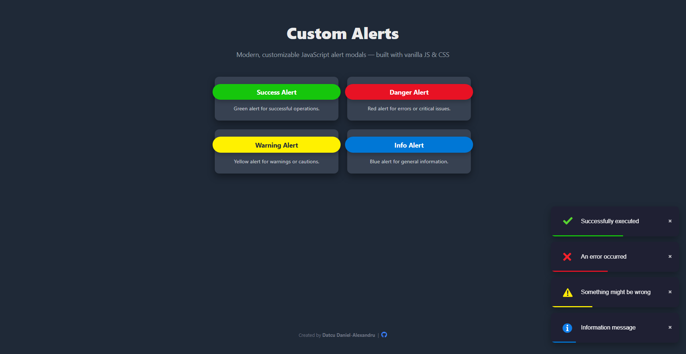

<h2 align="center">🔔 Custom Alerts – JavaScript Modal Library</h2>
<p align="center">
   
  
  
   
  
</p>
<p align="center">📅 Created in 2026</p>

---

## 🧠 Project Description

**Custom Alerts** is a lightweight, dependency-free JavaScript library that replaces the default browser `alert()`, `confirm()` and `prompt()` dialogs with modern, customizable modal popups.

The library is built entirely from scratch using **vanilla JavaScript and CSS**, without external frameworks or UI librries.

It provides  clean, reponsive design and a simple API for integrating stylish alert dialogs into any web project.

<!-----

## 🌐 Preview

<p align="center">
  
</p>

🔗 Live Demo: https://danislw.github.io/Custom-Alerts/

*You can test the library directly through GitHub Pages.*-->

---

## 🧩 Project structure

The project is organized as follows:

```
Custom-Alerts/
│
├── alerts.js        # Core JavaScript logic
├── alerts.css       # Styling for alert modals
├── index.html       # Demo page
├── README.md
└── LICENSE
```


### Main Components
- 🔔 **Core Alert Engine** – Generates and controls modal dialogs dynamically
- 🎨 **Custom Styling System** – Modern UI built with CSS3
- 🧩 **Configurable API** – Supports different alert types and input fields
- 🌐 **Demo Page** – Demonstrates implementation and usage examples

---

## ✨ Features
- ✅ Success, Error, Warning, Info alerts
- 📝 Custom input fields (text, password, etc.)
- 🎨 Fully customizable styling
- 📱 Responsive layout
- ⚡ Lightweight and fast
- 📦 No dependencies

---

## 🛠️ Technologies Used

This project was developed using:

- 🧱 **HTML5** – Demo structure 
- 🎨 **CSS3** – Modal styling and animations
- ⚡ **JavaScript (ES6)** – Alert logic and DOM manipulation

👉 No external libraries or frameworks were used. All functionality and styling are implemented manually.

---

## 🚀 Basic Usage Example

```
showAlert('An error occurred', 'danger');
```

---

## 📄 License

MIT License

You re free to use, modify, and distribute this software in peronal or commercial projects under the terms of the MIT license.

---

## 👨‍💻 Author

Created and maintined by
**Datcu Daniel-Alexandru**
